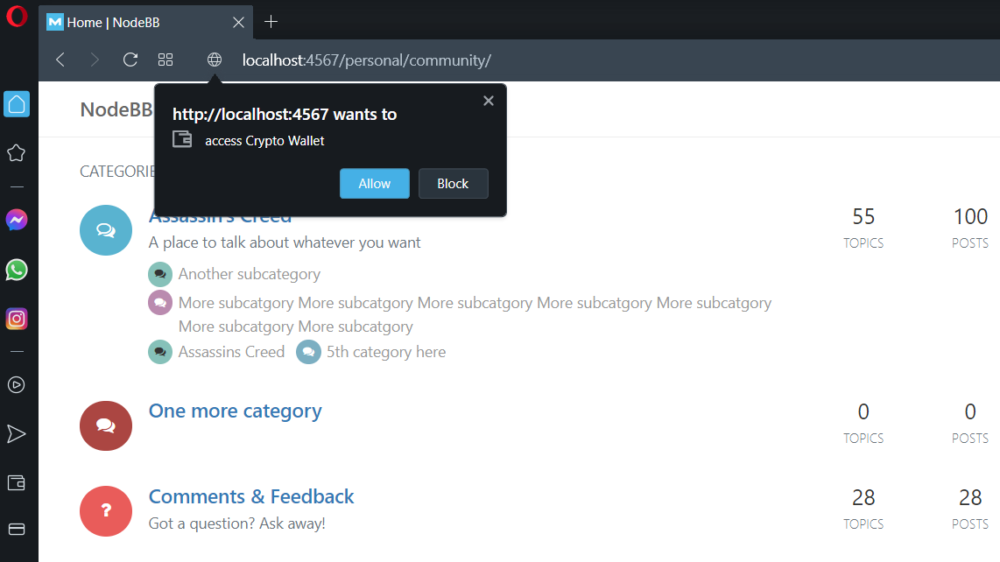
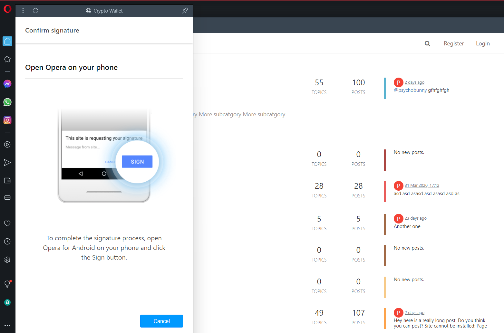
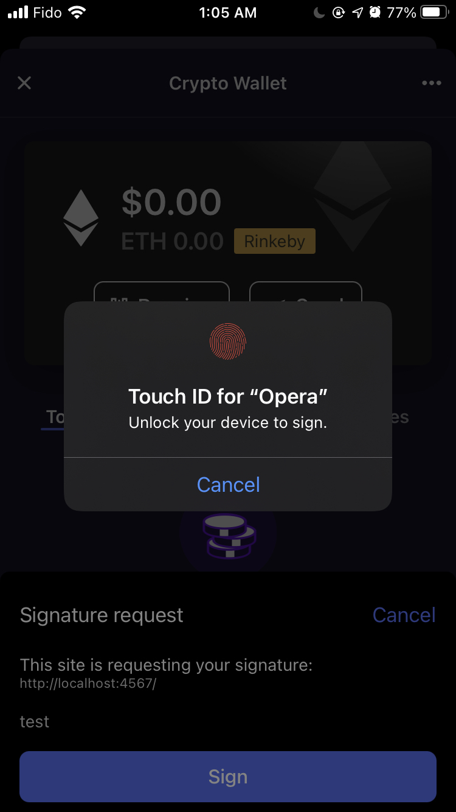
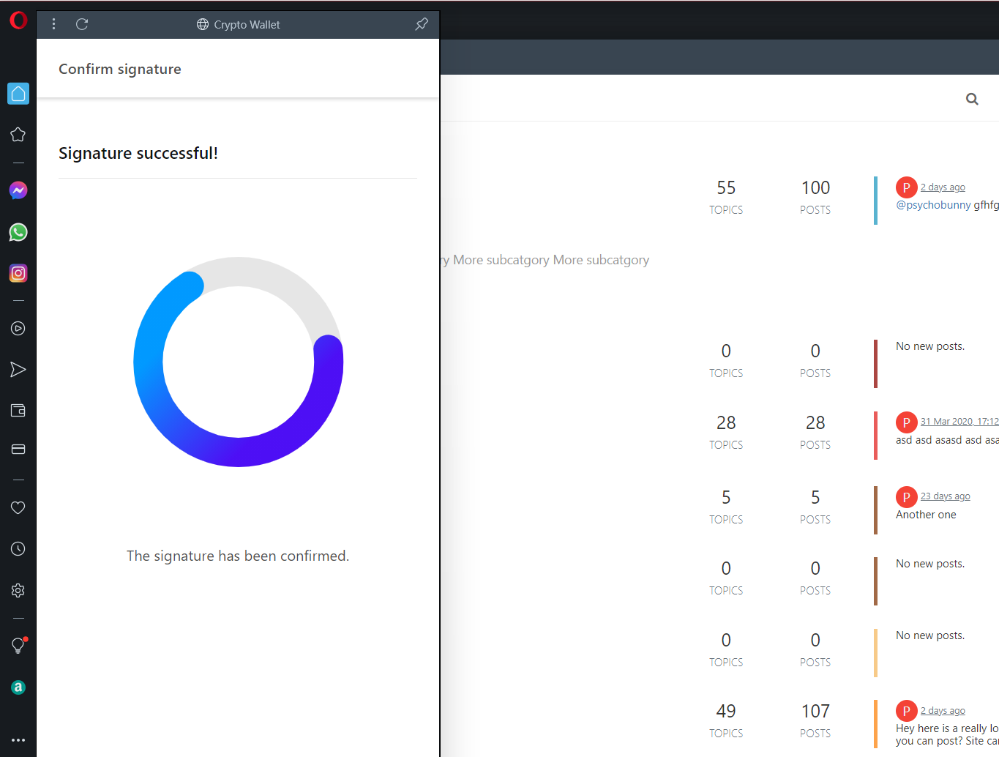
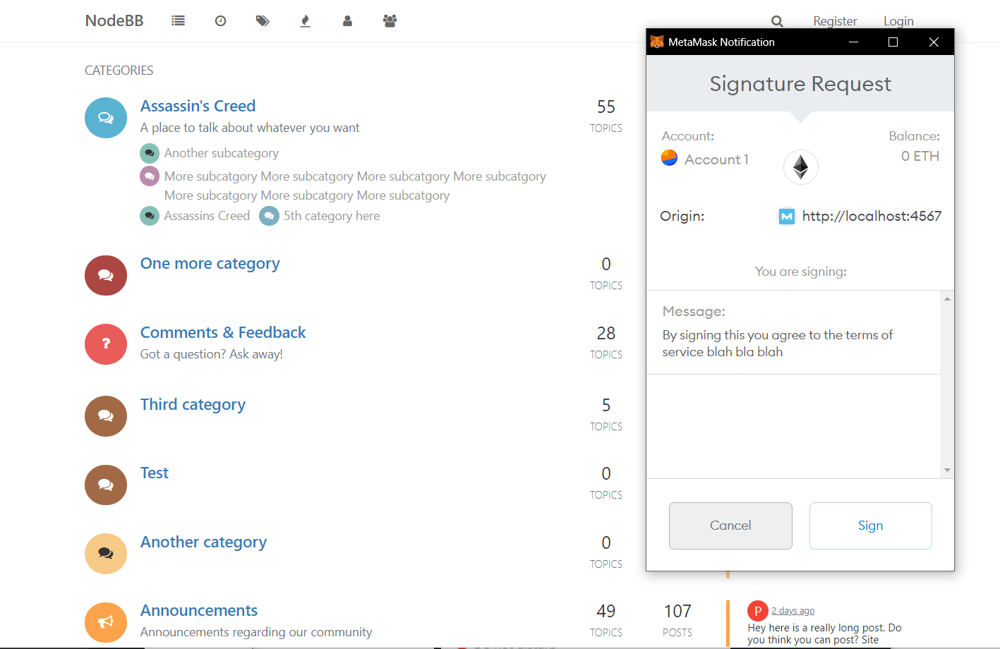

# Web3 SSO for NodeBB forums

Allows you to authenticate with NodeBB forums using your crypto wallet via Web3 clients.

Use a browser that supports Web3 out of the box such as [Opera Browser](https://www.opera.com/crypto), [Brave](https://brave.com/) or similar ([Add your Web3 browser / browser plugin here!](https://github.com/psychobunny/nodebb-plugin-sso-web3/edit/main/README.md)).

Alternatively, download a browser plugin such as [MetaMask](https://metamask.io).

## Screenshots

A picture is worth a thousand words, so here is five thousand for you.

Metamask allows you to show a message to the user, which is taken from your forum's Terms of Service (ACP -> Settings -> User -> User Registration -> Forum Terms of Use). 

 

## Help! I don't know what I'm doing!

Neither do I, but you can visit our [NodeBB forums](https://community.nodebb.org) and if I'm free (toomanyprojects.gif) I can help you figure it out. Alternatively you can file an issue and I'll try to support this.

## Is this secure?

No. Because I wrote it. Please review this code as well as the [passport module](https://github.com/psychobunny/passport-dapp-web3) and read the code yourself and verify if it's gud before even thinking about deploying this to production.

## Is this the best way to do this?

Probably not, and also if it was, I'd put serious money on the spec changing in 6 months time anyways. If this repo hasn't been touched in 1+ years, proceed with caution.
